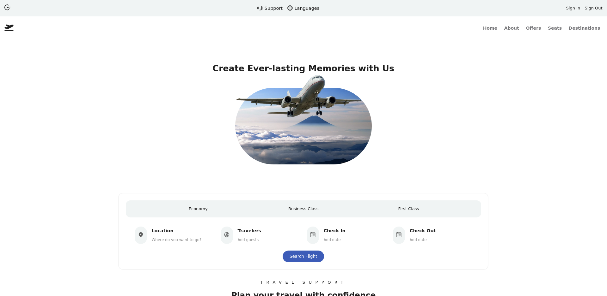
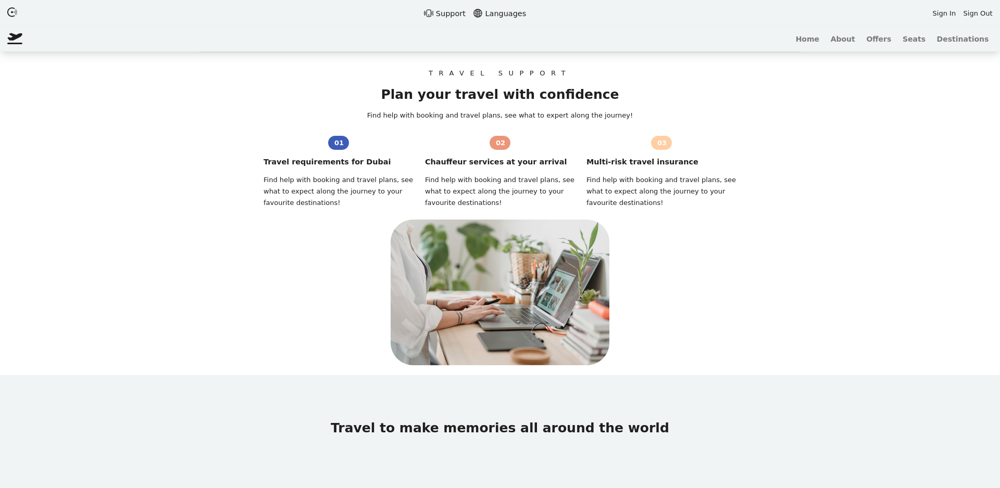

### Create a Responive Fly Website Using React js & Sass from scrath

🤗 Hello, I'm mrvin100 and i'm happy to learn/ introduce react Js and Sass to build this great project That's covers the basic concepts of Using components and introduce integration of sass to styles it from scratch 😏.

Don't Afraid 🧐, you going to be suprise ! Get's start you will tell me what you are filling 🤫.

cover images of project 👇 (great design)

✍ : Ps:"Where is my mind ?, what may i do to discover it ?"
